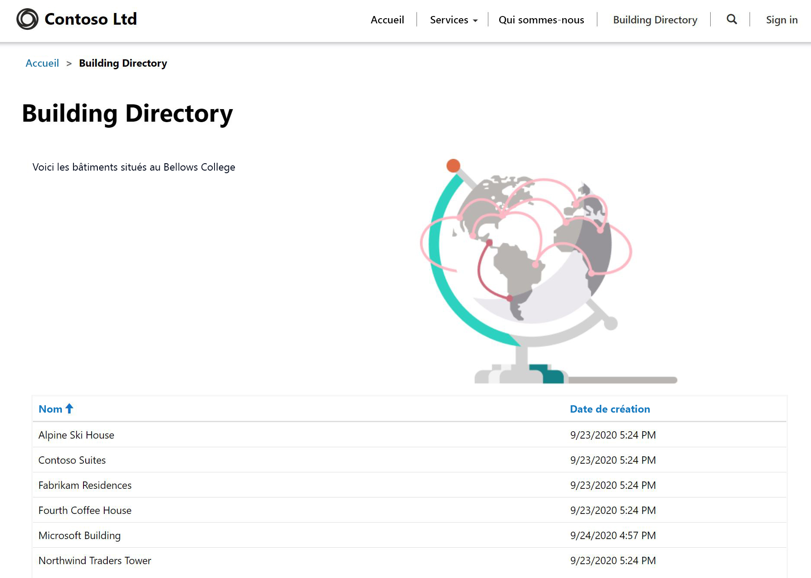

---
lab:
    title: 'Labo 5 : comment créer un portail Power Apps'
    module: 'Module 3 : Premiers pas avec Power Apps'
---

# Module 3 : Premiers pas avec Power Apps

## Labo 4 : Comment créer un portail Power Apps

# Scénario

Bellows College est une organisation éducative disposant de plusieurs bâtiments sur le campus. Les visites sur le campus sont actuellement enregistrées dans des journaux papier. Les informations ne sont pas saisies de manière cohérente et il n’y a aucun moyen de collecter ni d’analyser les données concernant les visites sur l’ensemble du campus.

L’administration du campus souhaite fournir aux visiteurs des informations sur les bâtiments du campus. Les visiteurs pourront voir la liste des bâtiments sur un site web, construit à l’aide d’un portail Power Apps.

Dans ce labo, vous allez configurer un portail Power Apps et créer une page web de portails qui affichera une liste des bâtiments du campus.

# Étapes de labo de haut niveau

Vous suivrez le plan ci-dessous pour concevoir le portail Power Apps :

* Configurer un portail Power Apps dans l’environnement Common Data Service
* Créer et configurer une page web pour afficher une liste des bâtiments
* Créer un nouveau thème et l’appliquer au portail

## Prérequis

* Achèvement du **labo 0 du module 0 : Valider l’environnement de laboratoire**
* Achèvement du **labo 1 du module 2 : Introduction à Common Data Service**

## Éléments à considérer avant de commencer

* Les applications Portails Power Apps sont toujours lancées à partir d’un modèle et non d’une application vide. Une fois que vous avez configuré un portail, il est déjà doté de pages, de menus et d’un thème par défaut.

# Exercice \#1 : Configurer un portail Power Apps

**Objectif :** Dans cet exercice, vous allez configurer un portail Power Apps dans votre environnement, qui sera accessible depuis n’importe quel emplacement du Web.

## Tâche \n°1 : Configurez un portail Power Apps

1.  Créez une nouvelle application de portail.

    -   Connectez-vous à <https://make.powerapps.com>

    -   Si l’**Environnement** affiché en haut à droite n’est pas votre environnement de pratique, sélectionnez votre environnement.

    -   Cliquez sur le panneau **Portail à partir de zéro** sous **Créer votre propre application**

2.  Fournissez de nouveaux détails sur le portail

    -   Saisissez **Visiteurs du Bellows College** comme **Nom** du portail

    -   Fournissez une URL unique : **quelque chose**.powerappsportals.com (si le nom est déjà pris, choisissez-en un autre)

    -   Sélectionnez un **Langage** pour le portail de base

    -   Cliquez sur **Créer**

3. Le processus d’approvisionnement du portail durera de 30 à 45 minutes.  Veuillez être patient.

Tâche \n°2 : Accédez au portail
--------------------------------

1.  Vous recevrez une notification dans <https://make.powerapps.com> lorsque le portail aura été approvisionné

2.  Ouvrez le nouveau portail

    -   Cliquez sur **Application**

    -   Localisez l’application qui possède le **Type** **Portail**

    -   Cliquez sur le nom de l’application

3.  Vous serez redirigé vers un site web de portail et sur la page d’arrivée, avec un message de bienvenue

Exercice \#2 : Créez une page web de portail
===============================

**Objectif :** Dans cet exercice, vous allez créer une nouvelle page web qui affichera du contenu statique, ainsi qu’une liste des bâtiments du Common Data Service.

Tâche n°1 : Créer une page web
--------------------------------

1.  Ouvrez Portails Power Apps Studio

    -   Connectez-vous à <https://make.powerapps.com> (peut rester constamment ouvert dans vos onglets)

    -   Localisez l’application qui possède le **Type** **Portail**

    -   Cliquez sur les ellipses (**...**) et choisissez **Éditer**

2.  Vous êtes maintenant dans le studio Portails Power Apps. C’est ici que vous pouvez modifier et créer le contenu du portail.

3.  Créer une nouvelle page

    -   Dans la barre de commandes, sélectionnez **Nouvelle page**

    -   Passez la souris sur **Dispositions fixes** et choisissez **Page avec titre**

4.  Modifiez les propriétés de la page

    -   Dans le volet des propriétés, sous **Afficher**, changez le **Nom** de **Nouvelle page (1)** à **Répertoire du bâtiment**, appuyez sur la touche Tab (pour lancer l’enregistrement automatique)

    -   Le titre de la page doit maintenant indiquer **Répertoire du bâtiment**

    -   Dans l’**URL partielle**, changez la valeur en **répertoire de bâtiment**, appuyez sur la touche Tab (pour lancer l’enregistrement automatique)

Tâche n° 2 : Ajouter du contenu statique
--------------------------------

1.  Ajouter une section à la page web

    -   Sur le canevas (zone affichant la page web), sélectionnez la section **Copie de page**. Il s’agit de la grande zone autour des 2 phrases de texte au milieu de votre page.

    -   Sur la ceinture porte-outils (côté gauche), sélectionnez l’icône **Composants**

    -   Choisissez **Section deux colonnes** dans la zone **Disposition de la section**

2.  Ajouter du texte statique

    -   Sur le canevas (zone affichant la page web), sélectionnez la colonne de gauche

    -   Sur la ceinture porte-outils (côté gauche), sélectionnez l’icône **Composants**

    -   Choisissez **Texte** dans la zone **Composants du portail**

    -   Dans la nouvelle zone de texte, saisissez le texte suivant :
          ```
          Voici le répertoire du bâtiment.
          ```
    -   Sélectionnez la zone de texte au-dessus de celle que vous venez de modifier, puis cliquez sur **Supprimer** dans la barre de commandes pour supprimer le texte par défaut.

3. Ajouter une image

    -   Sur le canevas (zone affichant la page web), sélectionnez la colonne de droite

    -   Sur la ceinture porte-outils (côté gauche), sélectionnez l’icône **Composants**

    -   Choisissez **Image** dans la zone **Composants du portail**

    -   Dans le volet des propriétés, cliquez sur **Sélectionnez une image**. Localisez et sélectionnez **Produit A.png**
    
    -   Dans le volet des propriétés, cliquez sur la liste déroulante de la section Mise en forme et modifiez la **Largeur** à 70 % (assurez-vous de saisir le %). Vous pouvez jouer avec la taille de l’image jusqu’à ce qu’elle soit comme vous le souhaitez.

4.  Cliquez sur **Parcourir le site web** pour afficher la page jusqu’à présent.  Notez la présence de l’option **Répertoire du bâtiment** dans le menu principal.

Tâche n° 3 : Ajoutez un composant de liste
--------------------------------

1.  Ouvrez Portails Power Apps Studio

    -   Connectez-vous à <https://make.powerapps.com> (peut rester constamment ouvert dans vos onglets)

    -   Localisez l’application qui possède le **Type** **Portail**

    -   Cliquez sur les ellipses (**...**) et choisissez **Éditer**
    
2.  Modifiez la page existante que vous avez créée précédemment

    -   Dans la ceinture porte-outils (côté gauche), choisissez l’option **Pages** 

    -   Localisez et sélectionnez la page **Répertoire du bâtiment** que vous avez créée précédemment
    
3.  Ajoutez un composant de liste

    -   Sur la ceinture porte-outils (côté gauche), sélectionnez l’icône **Composants**

    -   Choisissez **Section une colonne** dans la zone **Disposition de la section** (une section apparaîtra sous l’image et le texte sur la page web)

    -   Sélectionnez la nouvelle section de colonne sur le canevas

    -   Sur la ceinture porte-outils (côté gauche), sélectionnez l’icône **Composants**

    -   Choisissez **Liste** dans la zone des **Composants du portail** (un composant de liste apparaîtra dans la nouvelle section)
    
4.  Configurer le composant de liste

    -   Sélectionnez le composant de liste sur le canevas

    -   Dans le volet des propriétés (côté droit), saisissez **Liste des bâtiments** dans le champ **Nom**

    -   Dans le champ **Entité**, sélectionnez **Bâtiments** dans la liste déroulante.

    -   Dans les **Vues**, choisissez **Bâtiments actifs**

    -   Laissez les paramètres par défaut restants
    
5.  Cliquez sur **Parcourir le site web** pour afficher la page. Vous devriez voir la liste des Bâtiments du Common Data Service apparaître sur la page web.

Exercice \#3 : Modifier le thème du portail
===============================

**Objectif :** Dans cet exercice, vous allez créer un nouveau thème qui modifiera le modèle de couleurs de votre portail. 

Tâche n°1 : Appliquer et modifier un thème
--------------------------------

1.  Ouvrez Portails Power Apps Studio

    -   Connectez-vous à <https://make.powerapps.com> (peut rester constamment ouvert dans vos onglets)

    -   Localisez l’application qui possède le **Type** **Portail**

    -   Cliquez sur les ellipses (**...**) et choisissez **Éditer**
    
2.  Appliquer et personnaliser un thème de base

    -   Sur la ceinture porte-outils (côté gauche), sélectionnez l’icône **Composants**
    
    -   Basculez le bouton sur **Activer le thème de base** pour activer cette caractéristique.
    
    -   Sur l’un des préréglages, cliquez sur les ellipses (**...**) et choisissez **Personnaliser**
    
    -   Une copie du thème de base a été créée. 
    
    -   Dans le volet des propriétés, jouez avec la modification des couleurs et découvrez l’impact de ces modifications sur votre portail.
    
    -   Renommez votre thème
    
3.  Enregistrer vos modifications

    -   Dans la barre de commandes, cliquez sur **Configuration de la synchronisation**


La disposition de votre application doit ressembler à la structure suivante :



# Défis

* Créez une vue Bâtiments différente, qui affiche uniquement le nom du bâtiment. Sélectionnez **Parcourir le site web** dans le studio Portal pour voir les modifications.
* Sur la ceinture porte-outils, cliquez sur l’icône **Thèmes** et modifiez le CSS de votre thème personnalisé.
* Créez une page avec le composant **Formulaire** et modifiez un composant **Liste** pour ajouter ou modifier des enregistrements Common Data Service avec le formulaire.
* Si vous activez **Autorisations d’entité** dans les **Réglages**d’un composant **Liste**, qu’arrive-t-il aux données ?
* Dans le studio Portail, sélectionnez l’icône Éditeur de code source `</>` pour afficher la source de la page. Si vous êtes familiarisé avec HTML, apportez quelques modifications et affichez les résultats.
